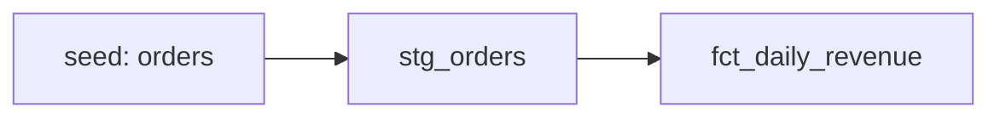

# dbt Quality Mart

Compact analytics-engineering project demonstrating **staging, marts, tests and documentation** in dbt.

## Model flow



## What it demonstrates

- Explicit staging and mart layers
- Source normalization before business logic
- `not_null`, `unique` and accepted-value tests
- Clear fact-table grain
- Reusable SQL transformation conventions
- Synthetic data only

## Run

```bash
dbt seed
dbt build
```

The project is intentionally compact: the goal is to make model grain, test coverage and transformation responsibilities easy to review.
