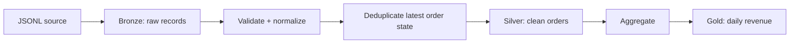

# Medallion Pipeline Reference

A small, runnable reference implementation of a **Bronze → Silver → Gold** data pipeline using only the Python standard library.

## What it demonstrates

- Raw event ingestion into a Bronze layer
- Schema validation and type normalization
- Deterministic deduplication by business key and update timestamp
- Silver-layer data-quality rules
- Gold-layer daily revenue aggregation
- Idempotent file outputs
- Unit tests for transformation logic

## Architecture



## Run

```bash
python src/pipeline.py --input data/orders.jsonl --output output
```

## Test

```bash
python -m unittest discover -s tests -v
```

The dataset is synthetic and the implementation is intentionally dependency-light so the engineering decisions remain easy to inspect.
